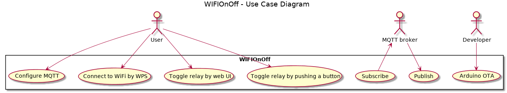
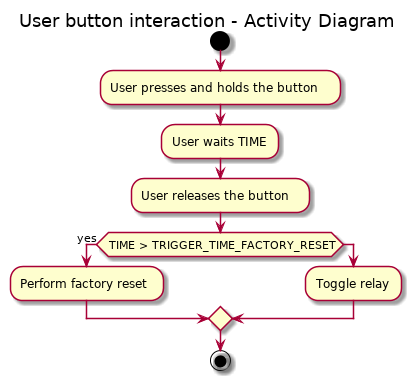

# Use Case Analysis

## Features Implemented
- WPS Push Button Configuration: I really ask myself, why WiFi Protected Setup is used so infrequently. It is convenient and you just need to push a button on your router and on your device. Many routers also offer the opportunity to press the push button over the web interface. So, you don't even have to walk. This is a must-have feature.
- HTTP interface: The user must be able to control the WIFIOnOff with a simple web interface. You don't want to walk to switch the caffee machine on or off. This is a must-have feature. It is also needed for MQTT support.
- MQTT support: If configured over the HTTP interface, the WIFIOnOff publishes the state of the relay and subscribes to a command channel. This is a nice-to-have feature. It is very interesting to experiment with MQTT to produce internet-of-things-like networks. In future, this feature might become more important.
- Arduino OTA: With over-the-air updates enabled, the WIFIOnOff can be flashed wirelessly. This is a nice-to-have feature. One can still flash over serial wire, but OTA is so much more convenient. This feature is NOT recommeded to be used in an untrusted environment.

## Features Not to Be Implemented
- Cloud: The WIFIOnOff does not need a cloud or an external internet connection to be useful. This is quite nice as your device does not become worthless, if the your cloud service provider discontinues service. It also offers some advantage in terms of data protection. You are still free to use external service providers.
- Timer: I tried to follow the UNIX philosophy when designing this program. The WIFIOnOff does one thing well: toggling the relay. It can be connected with other devices by MQTT. If you want to implement a timer, you can do this, as a script on a separate computer connected to the MQTT broker. You also get a GUI for free with an MQTT smartphone app.

## Use Case Diagram

# Boundary Conditions
- XSS protection: The HTTP web interface accepts user input which must be sanitized. The approach that is used in this project is whitelisting. The goal is to prevent XSS attacks.
For more information about XSS, look [here](https://www.owasp.org/index.php/XSS_(Cross_Site_Scripting)_Prevention_Cheat_Sheet).

# Button Interaction

